[toc]


发布于: 
创建时间: 2022-1-8 19:51:25
点赞总数: 124
评论总数: 13
收藏总数: 232
喜欢总数: 21

## 0x00 前言

上一篇文章的链接：[重新理解PBR（1）](https://zhuanlan.zhihu.com/p/416112744)

本文主要是以我个人的视角去尝试为全局光照构造一个理解的脉络，并会对涉及到的技术方案及原理做一些讲解。首先，还是老规矩

> 如果你觉得这篇文章对你有所帮助，欢迎点赞、投币（划掉）、收藏，发现文中有错误或是有不同意见，欢迎在评论交流（如果能的话），实在不行就点个感谢吧。

那么下面正式开始

## 0x01 渲染方程再出发

在开头还是请出我们的老朋友，丢掉自发光项的渲染方程：

$$L_0(x,\omega)=\int_{\Omega}^{}f_r(x,\omega,\omega_i)L_i(x,\omega_i)\cos(\omega_i,n)d\omega_i$$

右边是个半球积分，积分就是求和，如果我们知道所有入射Radiance的具体值和方向，也可以写为下式：

$$L_0(x,\omega)=\sum_{i=0}^{N}f_r(x,\omega,\omega_i)L_i(x,\omega_i)\cos(\omega_i,n)$$

这里的入射Radiance$L_i(x,\omega_i)$可以来自任何光源，根据光源的类型我们可以将其分为 **直接光源（Direct Light）** 和 **间接光源（Indirect Light）** 。其中：

-   直接光源是指物体自身发出的光，比如灯泡、蜡烛、荧光棒、太阳
-   间接光源是指物体反射出来的光，直接看图，下边的右图，两边的墙壁反射出自身的颜色，照亮了场景中的物体

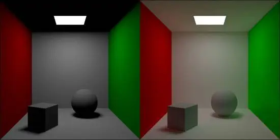

这样我们可以给出全局光照与局部光照的定义：

-   局部光照（Local illumination）：物体仅受直接光源影响的光照模型
-   全局光照（Global illumination）：物体同时受到直接光源和来自场景中其他物体反射来的间接光源影响的光照模型
-   光栅渲染就是一种局部光照模型，在进行光照着色时仅保留了着色点和直接 光源的信息
-   光线追踪则是一种全局光照模型，会考虑光线在物体之间的弹射
-   还有其他全局光照模型，例如光子映射

全局光照与局部光照的区别在于是否考虑间接光照，但是在光栅渲染上，我们可以通过很多方法来“打补丁”，为光照着色带入额外信息，实现部分的全局光照效果。我们熟悉的Shadow Map就算是补丁的一种，通过贴图的方式保存了部分的场景中物体互相遮挡的信息。

真正的全局光照算法，目前还很难应用在实时渲染领域，硬件的算力还有几个数量级的差距。平时在实时渲染中我们说的“全局光照”，都是通过各种方法在光栅渲染的基础上实现近似的效果。就算是号称实时光线追踪的RTX，也仅仅是在光栅渲染后，用光追来绘制反射、阴影等，做一个后处理。

## 0x02 问题提出、拆解与解析

在为直接光源进行着色时，因为光源的方向、位置、强度、衰减等信息已知，很容易可以计算得到入射的$L_i(x,\omega_i)$，然后计算得到每个直接光源的$f_r(x,\omega,\omega_i)L_i(x,\omega_i)\cos(\omega_i,n)$，求和，便是最终的着色结果。

但间接光照就很麻烦了，因为场景中任意一点反射出的光都有可能会弹射到我们的着色点，而我们不可能去遍历场景中的每一个点。可行的办法是用蒙特卡洛算法进行暴力求解，也就是随机向法线半球发射N条光线，计算打到的位置的光照，将其当作光源照亮着色点，再求平均值。离线渲染领域就是这么做的，但实时渲染中显然不会有这么充足的时间去计算，我们需要更快的方法，解决下面两个问题：

1.  有哪些间接光源会向外发射Radiance？
2.  哪些方向的间接光源Radiance会到达着色点？

对于第一个问题，场景中的间接光不仅有由其他物体反射而来的光，还存在所谓的 **环境光照（Ambient Light）** 。顾名思义，环境光照是由周围环境产生的，可以理解为Skybox发出的间接光，通常使用 **基于图像的照明（Image Based-Lighting，IBL）** 来表示和计算。

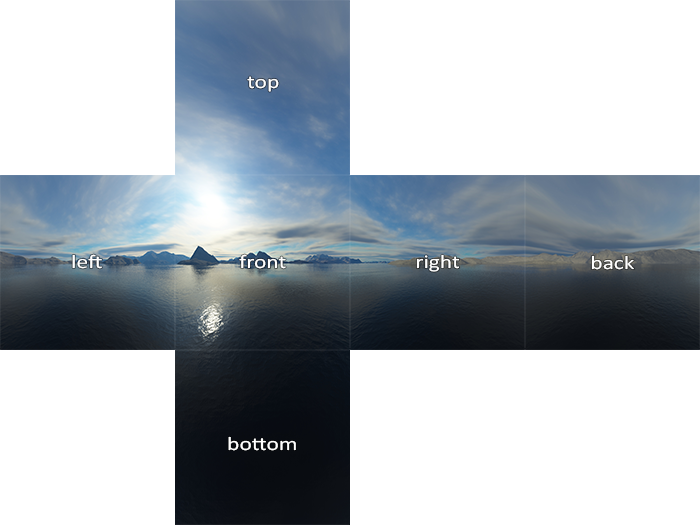

对于第二个问题，我们可以将到达着色点受间接光照亮产生的出射Radiance拆分为漫反射与镜面反射。在上一篇文章中我们已经计算过，反射率方程的漫反射部分可以写为如下的形式：

$$L_0(x,\omega)=\frac{Albedo}{\pi}\cdot\int_{\Omega}L_i(x,\omega_i)\cos(\omega_i,n)d\omega_i=\frac{Albedo}{\pi}\cdot Irradiance$$ 

这个式子说明，物体的漫反射出射Radiance，仅受Albedo与表面Irradiance影响，与观察方向无关。因此对于漫反射部分，只要统计出物体表面的Irradiance，即可比较轻松地求得出射Radiance。由于Irradiance是一个变化频率较低的变量，即 **低频信号** ，这使得我们可以用较小的数据量就存储下整个场景的光照信息（Lightmap，每个着色点一个float4），或是用一些比较简单的基函数拟合（二阶球谐，每个位置9个float3）。现代的实时渲染管线中，为光栅渲染加入漫反射全局光照的技术方案已经非常成熟，并被广泛使用，甚至我们平时听说的“全局光照”方案，一般就是特指的漫反射部分。

与漫反射部分相对的是，镜面反射部分是一个 **高频信号** ，因为入射光的方向取决于观察方向，只有入射方向附近的间接光源才会对出射Radiance有贡献。间接光镜面反射的实时求解目前还是比较困难的，没有太好的办法，未来RTX技术的推广可以很大地提高这一部分的渲染质量。

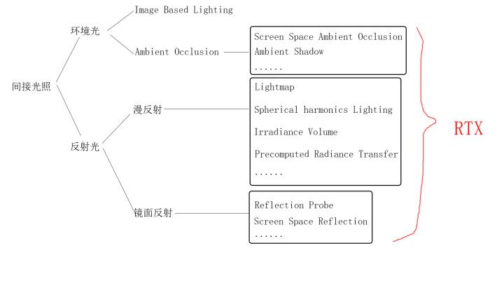

## 0x03 环境光照

相信大家最开始接触到环境光都是在学习基础光照的时候，为了保证在没有任何灯光的时候屏幕不至于一片漆黑，我们会在Shader里加上一个很暗的保底颜色，作为一个非常简单的环境间接光照的近似。

```text
float3 ambient = float3(0.1, 0.1, 0.1);
```

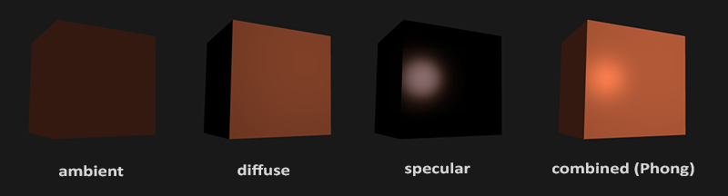

实际开发中，通常是使用一张 **立方体贴图（Cubemap）** ，一方面实现Skybox的效果，另一方面也是将Cubemap上每一个像素作为一个光源，颜色值为其Radiance，向立方体中心位置投射光（默认所有着色点都在中心位置）。而这就是Image Based Lighting的含义——将图像的像素作为光源对物体进行照明。

按照此原理，如果对于每个着色点，我们遍历整个Cubemap的所有像素点光源，求出漫反射结果并求和，不就可以获得此点的漫反射Irradiance了吗。而且我们可以发现，$\int_{\Omega}L_i(x,\omega_i)\cos(\omega_i,n)d\omega_i$这个式子，当默认x为原点时，计算结果只会与法线方向有关。因此，我们可以用一张新的Cubemap，以像素uv位置作为法线方向，离线计算并保存Irradiance值，也就是Learn OpenGL上面说的漫反射辐照图（还记得Irradiance的中文名就叫辐射照度吗）

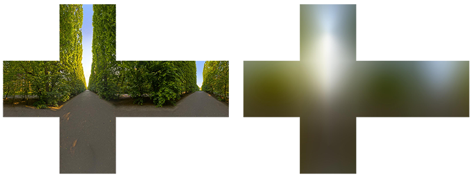

在漫反射之外，环境光造成的镜面反射也可以找类似的方法去离线计算再实时采样，不过这些方法其实都是比较黑科技的trick，本文的目标是梳理原理，就不对具体的技术细节做过多介绍了。

## 0x03A 环境光遮蔽（Ambient Occlusion）

前一节中说到，用IBL做环境光照是默认所有着色点都处在中心位置的，这样即使一个点周围全被挡住了，依然会受到完全的环境光照，这显然是不合理的，因此就需要做 **环境光遮蔽（Ambient Occlusion）** 。

AO的物理原理就是阴影，阴影这东西在光栅渲染里一直都是非常麻烦的存在。对于直接光照，我们可以用Shadowmap，因为光源数量有限，但算环境光照的时候，对每个像素光渲染一个Shadowmap显然在性能上是不可接受的，目前只能用一些比较黑科技的方法去近似。这些黑科技的代表就是 **屏幕空间环境光遮蔽（Screen Space Ambient Occlusion，SSAO）** 。

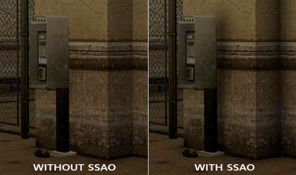

SSAO的具体做法是，在深度图上逐像素进行计算，通过深度值，UV坐标和投影逆矩阵反推得到世界坐标，随后在该点的单位半球内随机进行采样。计算采样点的深度值，与深度图中对应位置进行比较，判断是否遮挡，最后以被遮挡数除以采样总数作为AO的因子，乘在环境光项上。

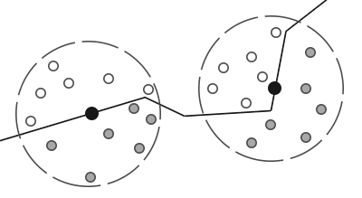

这个算法真的很简单，效率也快。后面还出现了在法线半球内采样的改进方法，因为延迟渲染中本来就有法线图，所以几乎是0 cost，效果还更好，因此成了现在游戏的标配。

事实上，SS系的所有算法（SSAO、HBAO、SSR等）几乎都是纯纯的黑科技，虽然效果看起来不错，但原理上一点也不正确，完美实践了图形学第一定律：

> 只要看上去是对的，那它就是对的。

SS系算法的都基于一个核心思想：读取全屏深度图，也就是深度缓冲区，结合摄像机数据，可以获得一部分的场景结构数据，以此在局部光照中近似计算一些全局光照的效果。技术细节我们还是不多讲，来看看从深度反推世界坐标是怎么做的：

可以先看看这篇：[重新认识剪不断理还乱的矩阵变换](https://zhuanlan.zhihu.com/p/223033896)

1. $(u \cdot 2-1,v \cdot 2-1,z)=(x,y,z)_{ndc}$
2. $(x,y,z)_{ndc}=\frac{(x,y,z)_{clip}}{w_{clip}}$
3. $(x,y,z,1)_{world} \cdot VP=(x,y,z,w)_{clip}$
4. $(x,y,z,1)_{world}=VP^{-1} \cdot (x,y,z,1)_{ndc} \cdot w_{clip}$
5. $(VP^{-1} \cdot (x,y,z,1)_{ndc}).w=w_{clip}$
6. 令$C=VP^{-1} \cdot (x,y,z,1)_{ndc}$
7. $(x,y,z)_{world}=\frac{C_{xyz}}{C_w}$ 

也就是只需要VP矩阵的逆矩阵，深度图uv坐标以及深度值，就能反推回世界坐标。

## 0x04 漫反射全局光照（1）—— Lightmap

环境光照之后，我们再来看反射光中的漫反射部分。前面已经说到，漫反射项的目标就是求解像素点处的Irradiance，这就是一个float3值。那么我们立即可以想到，如果光源和场景都不变，每个点的Irradiance也是不变的，只要离线提前计算好，不就可以实现运行时的漫反射全局光照了吗？没错，这就是最原始的 **光照贴图（Lightmap）** 的原理。

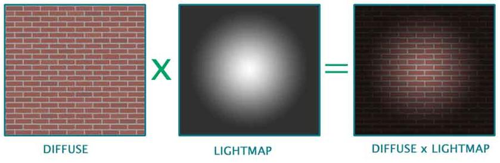

首先确定好场景中的静态物体与静态光源，随后使用光线追踪等方式，离线计算每个点的Irradiance值，最后保存到一张贴图中供运行时进行采样。

Lightmap的优点在于比较直观和简单，运行时只需要多采样一次就能获得漫反射全局光照的效果，但缺点也同样突出：

-   Lightmap只适用于静态场景和静态灯光，动态物体与之不好融合
-   Lightmap烘焙耗时很长，稍微一编辑场景和灯光就要等很久才能看效果
-   Lightmap占用空间很大，因为静态场景的每一个位置都要包括进去
-   如果选择省空间而使用分辨率较低的Lightmap，则会损失最终渲染的效果

后面针对Lightmap的这些缺点，也陆续有许多改进型技术，但这条路线先天缺陷比较大，已经走到头了。

## 0x05 漫反射全局光照（2）—— 球谐光照

 **球谐光照（Spherical Harmonic Lighting）** 则是用另一种思路来求解的全局光照，其核心思想是使用球谐基函数来近似表示光源函数，简化计算。底层的原理是，任何一个函数，都可以由一组基函数以及系数来进行表示：

$$f(x)=\sum_{i}^{n}{c_i \cdot B_i(x)}$$

其中$c_i$为系数，$B_i(x)$为基函数

我们熟悉的傅立叶变换，就是使用$\sin(nx)$和$\cos(nx)$作为基函数，用来表示任何的周期信号。举个例子，假设有一个函数：

$$f(x)=2+\frac{1}{2}\sin x+\frac{1}{4}\sin 2x$$

而我们使用的基函数为：

$$B_i(x)=(1,\sin x,\sin 2x)$$

则此函数对应的系数为：

$$c_i=(2,\frac{1}{2},\frac{1}{4})$$ 

球谐基函数与傅立叶级数类似，是一组定义在球面坐标系上的基函数，对于任何$f(r,\theta,\varphi)$都可以表示为一组球谐函数的和。利用

$$x=r\sin\theta \cos\varphi$$

$$y=r\sin\theta \sin\varphi$$

$$z=r\cos\theta$$ 

也可以将球面坐标转化为我们熟悉的直角坐标。直角坐标下的球谐基函数的前二阶长下面这样：

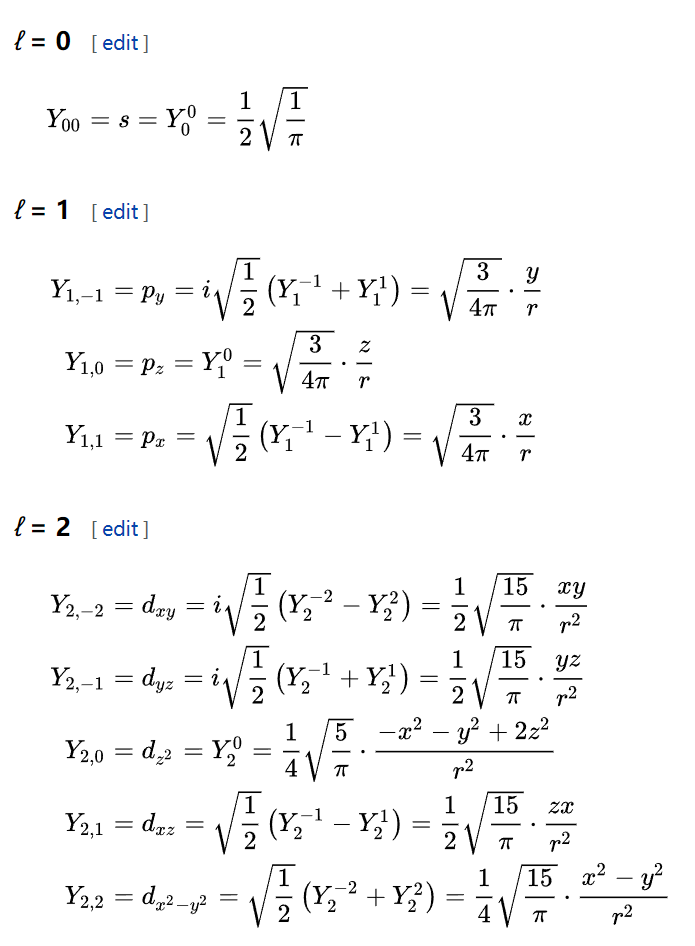

这个东西怎么来求光照捏？来跟着Unity中的球谐光照实现看一看就懂了，首先是有7个float4，共28个数，而二阶球谐一共需要9个系数，每个是float3，也就是27个。

```cpp
// ShaderVariables.hlsl

float4 unity_SHAr;
float4 unity_SHAg;
float4 unity_SHAb;
float4 unity_SHBr;
float4 unity_SHBg;
float4 unity_SHBb;
float4 unity_SHC;
```

其中SHAr、SHAg、SHAb是用来算0阶和一阶的

```cpp
// EntityLighting.hlsl

real3 SHEvalLinearL0L1(real3 N, real4 shAr, real4 shAg, real4 shAb)
{
    real4 vA = real4(N, 1.0);

    real3 x1;
    // Linear (L1) + constant (L0) polynomial terms
    x1.r = dot(shAr, vA);
    x1.g = dot(shAg, vA);
    x1.b = dot(shAb, vA);

    return x1;
}
```

这三个点乘是什么意思呢？我们观察三个一阶球谐函数（可以令r=1，因为是在单位球面上计算光照），可得：

$$B_{1}^{1}(x,y,z)=\sqrt{\frac{3}{4\pi}}x,\quad B_{1}^{-1}(x,y,z)=\sqrt{\frac{3}{4\pi}}y,\quad B_{1}^{0}(x,y,z)=\sqrt{\frac{3}{4\pi}}z$$

$$c^{1}_{1} B^{1}_{1}(x,y,z)+c^{-1}_{1}B^{-1}_{1}(x,y,z)+c^{0}_{1}B^{0}_{1}(x,y,z)=\text{dot}(SHAr,(x,y,z))$$

实际上每个点乘就是重建了一阶项。不过里还有个操作是有个w=1.0，这个跟SHA点乘之后其实就是0阶那个常数项。那么SHAr的含义是：

$$SHAr=(c^{1}_{1}\sqrt{\frac{3}{4\pi}},c^{-1}_{1}\sqrt{\frac{3}{4\pi}},c^{0}_{1}\sqrt{\frac{3}{4\pi}},c_0)$$

其中c都是float3 c值的r分量，剩下的SHAg，SHAb则是将c值替换为g和b分量。

PS：为什么重建原函数明明是系数乘基函数，但Unity里却是直接拿法线x,y,z去点乘呢？从上面就能看出来，可以把基函数里面那些常数系数也存到系数里面去。

再来看二阶项的代码，对照上面的基函数表，分析方法就是一样的了。

```cpp
// EntityLighting.hlsl

real3 SHEvalLinearL2(real3 N, real4 shBr, real4 shBg, real4 shBb, real4 shC)
{
    real3 x2;
    // 4 of the quadratic (L2) polynomials
    real4 vB = N.xyzz * N.yzzx;
    x2.r = dot(shBr, vB);
    x2.g = dot(shBg, vB);
    x2.b = dot(shBb, vB);

    // Final (5th) quadratic (L2) polynomial
    real vC = N.x * N.x - N.y * N.y;
    real3 x3 = shC.rgb * vC;

    return x2 + x3;
}
```

最后是全部结果加起来，SampleSH的结果就是漫反射全局光照的结果

```cpp
// Lighting .hlsl

half3 SampleSH(half3 normalWS)
{
    // LPPV is not supported in Ligthweight Pipeline
    real4 SHCoefficients[7];
    SHCoefficients[0] = unity_SHAr;
    SHCoefficients[1] = unity_SHAg;
    SHCoefficients[2] = unity_SHAb;
    SHCoefficients[3] = unity_SHBr;
    SHCoefficients[4] = unity_SHBg;
    SHCoefficients[5] = unity_SHBb;
    SHCoefficients[6] = unity_SHC;

    return max(half3(0, 0, 0), SampleSH9(SHCoefficients, normalWS));
}

// EntityLighting.hlsl

float3 SampleSH9(float4 SHCoefficients[7], float3 N)
{
    float4 shAr = SHCoefficients[0];
    float4 shAg = SHCoefficients[1];
    float4 shAb = SHCoefficients[2];
    float4 shBr = SHCoefficients[3];
    float4 shBg = SHCoefficients[4];
    float4 shBb = SHCoefficients[5];
    float4 shCr = SHCoefficients[6];

    // Linear + constant polynomial terms
    float3 res = SHEvalLinearL0L1(N, shAr, shAg, shAb);

    // Quadratic polynomials
    res += SHEvalLinearL2(N, shBr, shBg, shBb, shCr);

    return res;
}
```

最终来说，Unity这个球谐光照的原理是，将某一点处的Irradiance与法线(x,y,z)的函数关系用球谐基函数进行表示。运行时代入法线方向，可快速求解Irradiance，获取漫反射全局光照的效果。

球谐系数怎么求呢？这个网上的资料挺全的，本文就不继续展开了（主要是篇幅已经太长了- -），大概就是拍一张cubemap然后像上面IBL那节说的一样计算Irradiance map，再去投影到球谐函数。每一项系数的计算式如下：

$$c_i=\int_{\Omega}f(x)B_i(x)dx$$ 

G胖在半条命2里搞过一个叫Ambient Cube的算法，跟Unity这个球谐光照很像，只不过是对一个点直接保存上下左右前后六个法线方向的Irradiance值，运行时通过这六个值和法线计算得到最终的Irradiance，效果跟二阶球谐差不多。从原理上说，这两个算法只是对同一个原函数使用了不同的基函数来近似表达。

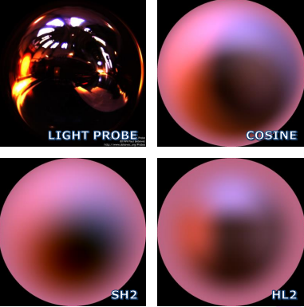

使用基函数对原函数进行展开，理论上是使用的基函数阶数越高，拟合结果越接近。但我们前面也说了，Irradiance是一个比较低频的信号，因此使用前二阶球谐函数的拟合结果已经足够使用，再加上更高阶的部分，需要的数据量急剧增大，但效果提升就不明显了。

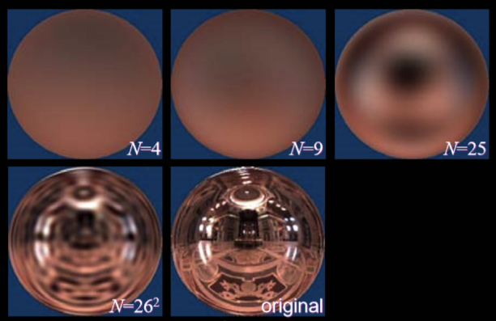

## 0x05A Precomputed Radiance Transfer

 **预计算辐射亮度传输（Precomputed Radiance Transfer，PRT）** 是球谐光照的进一步发展，主要是为球谐光照考虑了阴影与自阴影。准确的说，PRT应该是用来做AO的。因为像Unity那样在Probe处拍Cubemap再计算Irradiance这种做法，本身就已经考虑了物体间的遮蔽了。只有对于用IBL做的环境光照，我们才需要做额外的可见性计算，也就是在反射率方程中加上一项V：

$$L_0(x,\omega)=\int_{\Omega}^{}f_r(x,\omega,\omega_i)L_i(x,\omega_i)V(x,\omega_i)\cos(\omega_i,n)d\omega_i$$

这个V表示从$\omega_i$方向看向x有没有被遮挡。

上面这个式子中$L_i(x,\omega_i)$是光照项，$f_r(x,\omega,\omega_i)V(x,\omega_i)\cos(\omega_i,n)$统称Transport项。PRT的原理在于，如果我们将光照项用球谐函数拟合，则球谐系数与积分无关，可以提出：

$$\sum_{i}^{n}{c_i}\int_{\Omega}^{}B_i(x,\omega_i)f_r(x,\omega,\omega_i)V(x,\omega_i)\cos(\omega_i,n)d\omega_i$$

由于是漫反射，BRDF是一个常数，也可以提出积分外

$$\frac{Albedo}{\pi}\sum_{i}^{n}{c_i}\int_{\Omega}^{}B_i(x,\omega_i)V(x,\omega_i)\cos(\omega_i,n)d\omega_i$$ 

在上一节最后我们说过，将一个函数用球谐函数表示时，每一阶的系数可以用下列式子来求：

$$c_i=\int_{\Omega}f(x)B_i(x)dx$$

那么积分内的这一项，即可视作Transport项向球谐函数投影的系数

$$\int_{\Omega}^{}B_i(x,\omega_i)V(x,\omega_i)\cos(\omega_i,n)d\omega_i=c'_i$$

式子最终可以写为

$$\frac{Albedo}{\pi}\sum_{i}^{n}c_i \cdot c'_i$$ 

这个式子可以看作是两个球谐系数向量的点乘。 那么我们只要找到合适的Transport函数，就能在球谐光照中带入AO的效果了。

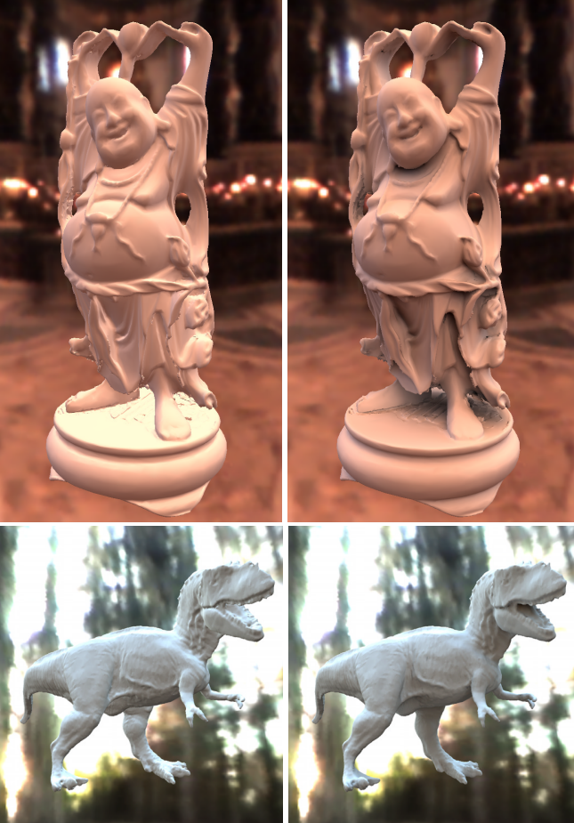

## 0x06 结语

不知不觉就写了小一万字了，真是不容易。本文主要是梳理了一下目前实时渲染领域中加入（漫反射）全局光照的一些方法，顺便把我自己学习过程中困惑了比较久的地方搞清楚了，分享给大家，希望能对你有所帮助。本来还打算写一下镜面反射部分的，但一个是篇幅已经太长了，二个是镜面反射部分除了一个SSR好像也没什么好写的，主要还是懒，索性就直接摆烂了吧。

那么，我们下期再见咯（如果有的话）。

  

原文地址：[重新理解PBR（2）——漫反射全局光照](https://zhuanlan.zhihu.com/p/452190320) 


