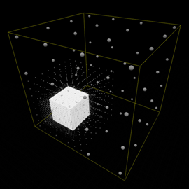
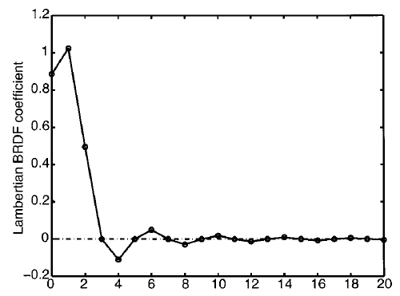
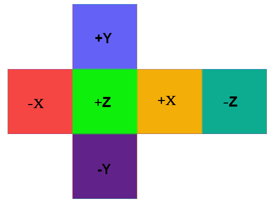
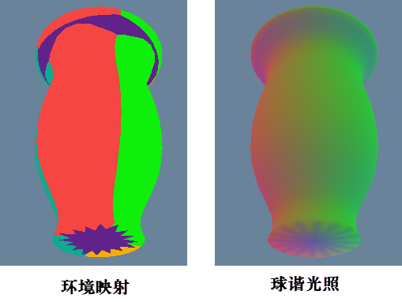
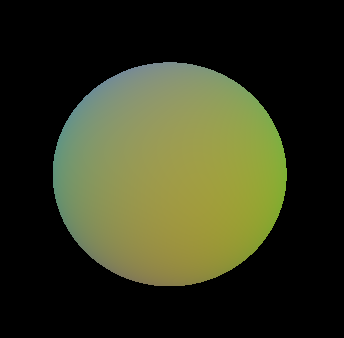

[toc]


发布于: 
创建时间: 2020-7-10 21:20:52
点赞总数: 172
评论总数: 21
收藏总数: 413
喜欢总数: 23

[chopper：目录](https://zhuanlan.zhihu.com/p/132540827)

光照可以简单的分为镜面反射光和漫反射光，基于图像照明技术（Image Based Rendering，IBL）相当于把环境贴图作为光照的来源，可以模拟全局光照中的镜面反射光和漫反射光。

我们讨论过基于图像照明技术在模拟全局镜面光的应用，参见"[基于图像的照明](https://zhuanlan.zhihu.com/p/149217557) "，需要对环境贴图离线预处理。同样，基于照明技术在模拟全局漫反射光的应用中，也需要对环境贴图离线预处理，生成的贴图称为 **辐照度环境贴图** （Irradiance Environment Mapping）。用辐照度环境贴图来模拟全局漫反射光存在一定的局限性：离线预处理计算量大，存储开销也大。漫反射光是一种 **低频** 信息，球谐函数组可以有效的重建低频信息，也就是数学上球谐函数的广义傅里叶展开的表示。Ravi［2］提出的，用球谐函数作为基底，投影生成9个系数（球谐系数），就可以有效重建环境贴图中低频的辐照度信息，这就是基于球谐函数的辐照度照明技术，也就是本篇文章要讨论的。

第1部分"辐照度照明"会介绍一般的辐照度照明技术和该技术的瓶颈，引出基于球谐函数的辐照度照明技术，并举了一个虚幻引擎应用球谐函数光照的例子，也就是间接光缓存技术（Indirect Light Cache） 。第2部分"数学推导"阐述了基于球谐函数的辐照度照明技术的理论推导和可行性验证。第3、4部分"投影"和"重建"，阐述了基于球谐函数的辐照度照明技术的两个主要的技术点：投影和重建。任何一个球面函数可以以球谐函数组作为基底进行广义傅里叶展开，生成球谐系数的过程，称为 **投影** ；根据生成的球谐系数来表示球面函数的过程，称为 **重建** 。

在github的网站上找到了一个基于球谐函数的辐照度照明的实现，参见[justinmeiners/spherical-harmonics](https://github.com/justinmeiners/spherical-harmonics)。虽然作者的实现存在一定的问题，但是技术实现的结构比较完备，不用从零造轮子，就在它的基础上进行改造验证。

文章目录：

-   辐照度照明
-   数学推导
-   投影
-   重建
-   参考

## 辐照度照明

对于一般的辐照度照明技术，分为两个阶段。首先，需要从环境贴图中提取漫反射光信息，生成一张辐照度环境贴图，如图1所示；接着，在实时渲染的每一个像素点上，根据它的法线信息，从辐照度环境贴图中获取光照信息，进行光照的计算。

![图1. 辐照度环境贴图[3]](images/2v2-4d10686adbe8d74d1c7f879d63fd1e72.jpg)

生成辐照度环境贴图的算法伪码如下所示，若输出的辐照度贴图的像素个数为M，输入的环境贴图像素个数是N，那么计算的复杂度就是O(MN)。举个例子，输出的辐照度的像素是8 \* 8 \* 8，生成辐照度贴图的离线开销也得到512 \* N，辐照度贴图的存储消耗是 512 \* 3字节，每个颜色通道至少1个字节。

```as3
diffuseConvolution(outputEnvironmentMap, inputEnvironmentMap){
    for_all (T0: outputEnvironmentMap){
        sum = 0
        N = envMap_direction(T0)
        for_all (T1: inputEnvironmentMap){
            L = envMap_direction(T1)
            I = inputEnvironmentMap[T1]
            sum += max(0, dot(L, N)) * I
            T0 = sum
            return outputEnvironmentMap
        }
    }
}
```

Ravi［2］提出的基于球谐函数的辐照度照明技术，每张辐照度贴图的每个颜色通道只需要存储9个系数，那么，RGB三个通道只需要存储27个系数，能有效地估计辐照度贴图信息。那么，它的离线预处理开销和存储开销也远低于一般的辐照度照明技术。

以虚幻引擎为例，它的间接光缓存技术，本质上就是基于球谐函数的辐照度照明技术。[如图2](https://docs.unrealengine.com/en-US/Engine/Rendering/LightingAndShadows/VolumetricLightmaps/index.html)所示，可以在空间内布置一系列的采样点，每个采样点生成一张环境贴图，再从环境贴图中提取投球谐系数，并保存下来。对于静态模型，可以通过烘焙来获取全局漫反射光；对于动态模型，可以通过这种技术来获取全局漫反射光。对处理空间内的动态模型，根据临近几个采样点的球谐系数，插值出新的球谐系数，从而来模拟它所接收到的全局漫反射光。



很多人可能对辐照度（也称辐射度，英文是Irradiance）和辐射率（英文是Radiance）等名词有点混淆。常说的双向反射分布函数是入射光辐照度与反射光辐射率的比值，也就是说我们需要计算出入射光的辐照度，再乘以双向反射分布函数，就是反射光的辐射率，这就是通常的光照计算流程。例如漫反射的朗伯特模型，只需要除以PI就好。

从数学的角度来说，球谐函数具有正交完备性、旋转不变性的性质。若球谐计算的次数 $l$ 越大，即生成的球谐系数越多，就会越好的重建原始的信息，如图3所示。辐照度贴图存储的是光照中的低频信息，低次数的球谐函数就可以较好的重建辐照度贴图中的低频信息，这就是简单的从数学原理上的简单理解。

![图3. 球谐系数越多，越能重建原始的环境贴图[6]](images/4v2-f7a1f6dae273adcb10d1a4e5ed50c74a.jpg)

接下来的"数学推导"部分，将会详细分析该技术方案在数学上的理论推导和可行性验证。

## 数学推导

[chopper：球谐光照——球谐函数](https://zhuanlan.zhihu.com/p/153352797)

参见上一篇文章，我们介绍了连带勒让德函数 $P_{l}^{m}\left( x \right)$ 的递归等式、球谐函数等式以及计算机实现方法，球谐函数表示为

$$Y_{l}^{m}\left( \theta ,\varphi  \right)=\left\{ \begin{matrix}    \sqrt{2}K_{l}^{m}\cos \left( m\varphi  \right)P_{l}^{m}\left( \cos \theta  \right) & m>0  \\    \sqrt{2}K_{l}^{m}\sin \left( -m\varphi  \right)P_{l}^{-m}\left( \cos \theta  \right) & m<0  \\    K_{l}^{0}P_{l}^{m}\left( \cos \theta  \right) & m=0  \\ \end{matrix} \right. \tag{1}$$ 

> 其中，$K_{l}^{m}$ 是归一化常数，表示为

$$K_{l}^{m}=\sqrt{\frac{2l+1}{4\pi }\frac{\left( l-\left| m \right| \right)!}{\left( l+\left| m \right| \right)!}}$$

球谐函数组具备正交完备的性质，使得任意一个球面函数 $f\left( \theta ,\varphi  \right)$ 可以用正交归一的球谐函数 $Y_{l}^{m}\left( \theta ,\varphi  \right)$ 进行广义傅里叶展开，这个过程就称为 **重建** ，表示为

$$f\left( \theta ,\varphi  \right)=\sum\limits_{l=0}^{\infty }{\sum\limits_{m=-l}^{l}{C_{l}^{m}Y_{l}^{m}\left( \theta ,\varphi  \right)}}$$

> 其中，广义傅里叶系数为 $C_{l}^{m}$ 。

$$C_{l}^{m}=\int_{0}^{2\pi }{\int_{0}^{\pi }{f\left( \theta ,\varphi  \right)Y_{l}^{m}\left( \theta ,\varphi  \right)\sin \theta d\theta d\varphi }}$$

生成球谐系数的过程，也称为 **投影** 。

对于平面上任意一点的入射光辐照度，可以表示为

$$E\left( {\omega_{i}} \right)=\int_{\Omega }{L\left( \omega  \right)\cos \theta d\omega }$$

> 其中，$L\left( \omega  \right)$ 表示方向为 $\omega$ 的辐射率，$\theta$ 是入射方向 $\omega$ 与平面法线的夹角。

我们的目标就是估计入射光的辐照度 $E\left( \omega_{i}  \right)$ ，它是由 **光照函数**  $L\left( \omega  \right)$ 和  **传递函数**  $\max(\cos \theta, 0)$ 两部分的乘积组成，我们分别对这两个函数以球谐函数组为基底进行展开。

把光照函数 $L\left( \omega  \right)$ 展开，表示为

$$L\left( \omega  \right)=\sum\limits_{l=0}^{\infty }{\sum\limits_{m=-l}^{l}{L_{l}^{m}Y_{l}^{m}\left( \theta ,\varphi  \right)}}$$

光照函数的球谐系数表示为

$$L_{l}^{m}=\int_{0}^{2\pi }{\int_{0}^{\pi }{L\left( \omega  \right)\cdot Y_{l}^{m}\left( \theta ,\varphi  \right)\sin \theta d\theta d\varphi }} \tag{2}$$

设传递函数 $A\left( \theta  \right)=\cos \theta$ ，这里有一个隐藏的条件：$\theta \in \left[ 0,\pi /2 \right]$ 。把传递函数展开，表示为

$$A\left( \theta  \right)=\sum\limits_{l=0}^{\infty }{\sum\limits_{m=-l}^{l}{A_{l}^{m}Y_{l}^{m}\left( \theta ,\varphi  \right)}}$$

传递函数的球谐系数可以表示为

$$A_{l}^{m}=\int_{0}^{2\pi }{\int_{0}^{\pi }{\cos \theta \cdot Y_{l}^{m}\left( \theta ,\varphi  \right)\sin \theta d\theta d\varphi }} \tag{3}$$

Ravi［1］在它的论文中，推导出 $E\left( \omega_{i}  \right)$ 可以表示为

$$E\left( \omega_{i}  \right)=\sum\limits_{l=0}^{\infty }{\sum\limits_{m=-l}^{l}{\sqrt{\frac{4\pi }{2l\ + 1}}L_{l}^{m}A_{l}^{0}Y_{l}^{m}\left( \theta ,\varphi  \right)}} \tag{4}$$

那么，设双向反射分布函数为 $brdf\left( {{\omega }_{i}},{{\omega }_{o}} \right)$ ，那么，最终的光照计算公式就可以表示为

$$B\left( {{\omega }_{o}} \right)=brdf\left( {{\omega }_{i}},{{\omega }_{o}} \right)\cdot E\left( \omega_{i}  \right) \tag{5}$$

等式（4）（5）有重要的意义， **表示只需要计算出光照函数和传递函数的球谐系数，通过两种系数的内积，就可以计算出环境贴图对模型的漫反射光贡献** 。

光照函数的球谐系数计算可以放到下一部分去讨论，先考虑传递函数的球谐系数推导。

由于

$$\int_{0}^{2\pi }{\cos \varphi d\varphi }=0,\int_{0}^{2\pi }{\sin \varphi d\varphi }=0,$$

易知，对于任意的 $m\ne 0$ 的情况下，有 $A_{l}^{m}=0$ ，所以我们只需要计算 $A_{l}^{0}$ 即可，后面统一用 ${{A}_{l}}$ 来表示 $A_{l}^{0}$ 。令 $x=\cos \theta$ ，代入等式（3），则有

$$A_{l}=2\pi \int_{0}^{1}{x\cdot Y_{l}^{0}\left( x \right)dx}$$

又由于 $P_{1}^{0}\left( x \right)=x$ 和 $Y_{l}^{0}\left( x \right)=K_{l}^{0}P_{l}^{0}\left( x \right)$ ，则有

$${{A}_{l}}=2\pi \sqrt{\frac{2l+1}{4\pi }}\int_{0}^{1}{P_{1}^{0}\left( x \right)\cdot P_{l}^{0}\left( x \right)dx}$$

$P_{l}^{m}\left( x \right)$ 表示 $l$ 次 $m$ 阶连带勒让德函数，对于连带勒让德函数而言，它有两条性质：

 **正交性** ，表示为

$$\int_{-1}^{1}{P_{k}^{m}\left( x \right)\cdot P_{l}^{m}\left( x \right)dx}=\frac{2\left( l+m \right)!}{\left( 2l+1 \right)\left( l-m \right)!}{{\delta }_{k,l}}$$

> 其中，当 $k=l$ 时，${{\delta }_{k,l}}=1$ ，否则，${{\delta }_{k,l}}=0$ 。  

 **奇偶性** ，表示为

$$P_{l}^{m}\left( -x \right)={{\left( -1 \right)}^{l+m}}P_{l}^{m}\left( x \right)$$

> 当 $m=0$ 的情况下，若 $l$ 为奇数，则 $P_{l}^{0}\left( x \right)$ 就是奇函数；若 $l$ 为偶数，则 $P_{l}^{0}\left( x \right)$ 就是偶函数。  

回过正题，当 $l\succ 1$ 时，由连带勒让德函数的奇偶性质，可知，当 $l$ 为奇数时，$P_{l}^{0}\left( x \right)$ 为奇函数，当 $l$ 为偶数时，$P_{l}^{0}\left( x \right)$ 为偶函数。

当 $l\succ 1$ 且 $l$ 为奇数时，由连带勒让德函数的正交性，可知

$$\int_{0}^{1}{P_{1}^{0}\left( x \right)\cdot P_{l}^{0}\left( x \right)dx}=\frac{1}{2}\int_{0}^{1}{P_{1}^{0}\left( x \right)\cdot P_{l}^{0}\left( x \right)dx}=0$$

即当 $l\succ 1$ 且 $l$ 为奇数时，有

$$A_{l}=0 \tag{6}$$

当 $l\succ 1$ 且 $l$ 为偶数时，有

$$A_{l}=2\pi \sqrt{\frac{2l+1}{4\pi }}\frac{{{\left( -1 \right)}^{\frac{n}{2}-1}}}{\left( n+2 \right)\left( n-1 \right)}\frac{n!}{{{2}^{n}}{{\left( \frac{n}{2}! \right)}^{2}}} \tag{7}$$

此外，很容易推导出 $A_{0}$ 和 $A_{1}$ 的值，为

$$A_{0}=\frac{1}{2}\sqrt{\pi },A_{1}=\sqrt{\frac{\pi }{3}} \tag{8}$$

对于传递函数的球谐系数，我们可以算出前5项的数值，表示为

$$\begin{aligned}   & A_{0}=\frac{1}{2}\sqrt{\pi }\approx \text{0}\text{.8862} \\   & A_{1}=\sqrt{\frac{\pi }{3}}\approx \text{1}\text{.0233} \\   & A_{2}=\frac{\sqrt{5\pi }}{8}\approx \text{0}\text{.4954} \\   & A_{3}=0 \\   & A_{4}=-\frac{\sqrt{9\pi }}{48}\approx \text{0}\text{.1108} \\  \end{aligned}$$

Ravi［1］在它论文中，绘制了一张次数 $l$ 变化时，系数 $A_{l}$ 随之变化的曲线图，如图4所示，可以发现，随着次数 $l$ 变大，系数 $A_{l}$ 会快速衰减。



再结合等式（4），可以得到结论：随着 $l$ 的变大，由于 $A_{l}$ 衰减的较快，所以对结果的贡献会越小，所以当我们只需要重建低频信息时，就不需要很高的次数 $l$ ，这就是Ravi［2］核心思想的来源。Ravi［2］提出， **只需要前3次，共9个球谐系数，就可以较好的重建环境贴图中的低频辐照信息** 。

至此，本部分得到三条重要的结论：

1.  根据等式（4）（5），环境贴图的漫反射光的计算可以分解为光照函数和传递函数的球谐系数的内积和；
2.  光照函数的球谐系数可以根据等式（2）来计算；
3.  传递函数的球谐系数可以根据等式（6）（7）（8）来计算。

为了方便后面的技术阐述，这里给出球谐函数的前三次的函数，表示为

$$\begin{aligned}   & Y_{0}^{0}=\frac{1}{2}\sqrt{\frac{1}{\pi }} \\   & Y_{1}^{-1}=-\frac{1}{2}\sqrt{\frac{3}{\pi }}y \\   & Y_{1}^{0}=\frac{1}{2}\sqrt{\frac{3}{\pi }}z \\   & Y_{1}^{1}=-\frac{1}{2}\sqrt{\frac{3}{\pi }}x \\   & Y_{2}^{-2}=\frac{1}{2}\sqrt{\frac{15}{\pi }}yx \\   & Y_{2}^{-1}=-\frac{1}{2}\sqrt{\frac{15}{\pi }}yz \\   & Y_{2}^{0}=\frac{1}{4}\sqrt{\frac{5}{\pi }}\left( 3{{z}^{2}}-1 \right) \\   & Y_{2}^{1}=-\frac{1}{2}\sqrt{\frac{15}{\pi }}zx \\   & Y_{2}^{2}=\frac{1}{4}\sqrt{\frac{15}{\pi }}\left( {{x}^{2}}-{{y}^{2}} \right) \\  \end{aligned}$$

## 投影

这部分要解决的问题是，给定环境贴图，将它投影至球谐基底，如何计算出投影的球谐系数，也就是光照函数的球谐系数。

计算光照函数的球谐系数，它的积分形式，如等式（2）所示，我们可以把它转为求和的形式来表示，就是

$$L_{l}^{m}=\sum\limits_{k=0}^{n}{{{L}_{k}}\left( \omega  \right)\cdot Y_{l}^{m}\left( \theta ,\varphi  \right)d\omega } \tag{9}$$

> 其中，${{L}_{k}}\left( \omega  \right)$ 表示环境贴图中的纹素信息，$n$ 表示环境贴图的纹素个数，$d\omega$ 表示对应纹素的立体角。

由前面的推导，可以得出结论：只需要前3次球谐函数组作为基底，共生成9个球谐系数，就可以较好的重建环境贴图中的辐照度信息。因此，我们只考虑前3次球谐函数。

在光照函数的球谐系数计算中，如等式（9）所示，有两个技术问题：

-   如何计算纹素的立体角；
-   如何根据环境贴图的纹理坐标计算法线信息。

我们采用的环境贴图是 **立方体贴图** （Cubemap）。

Rory［5］给出了任意一个纹素的立体角计算方法，如下所示，需要采用双精度double来表示，float格式误差会比较大，容易导致所有纹素的立体角之和不等于 $4\pi$ 。

```cpp
static double AreaElement(double x, double y)
{
    return atan2(x * y, sqrt(x * x + y * y + 1));
}

double TexelCoordSolidAngle(double a_U, double a_V, unsigned int a_Size)
{
    //scale up to [-1, 1] range (inclusive), offset by 0.5 to point to texel center.
    double U = (2.0f * ((double)a_U + 0.5f) / (double)a_Size) - 1.0f;
    double V = (2.0f * ((double)a_V + 0.5f) / (double)a_Size) - 1.0f;

    double InvResolution = 1.0f / a_Size;

    // U and V are the -1..1 texture coordinate on the current face.
    // Get projected area for this texel
    double x0 = U - InvResolution;
    double y0 = V - InvResolution;
    double x1 = U + InvResolution;
    double y1 = V + InvResolution;
    double SolidAngle = AreaElement(x0, y0) - AreaElement(x0, y1) - AreaElement(x1, y0) + AreaElement(x1, y1);

    return SolidAngle;
}
```

简单描述下立体角的计算推导过程，更详细的介绍可以参见Rory［5］。如图5所示，把一个立体贴图的一个面置于(0, 0, 1)的位置，那么它表示的范围就缩放到了［-1, 1］之间，接下来我们就要计算它在球面上投影的面积，就是我们要算的立体角的大小。

![图5. 纹素在球面上投影的立体角[5]](images/6v2-21f21cee134e109403975a2ba3cc5470.jpg)

球中心是(0, 0, 0)，对于贴图上任意一个纹素(u, v)，它的坐标可以表示为 $\left( x,y,1 \right)$ ，其中

$$x=2.0\frac{u+0.5}{size}-1.0,y=2.0\frac{v+0.5}{size}-1.0$$

那么，由球中心指向贴图纹理的向量，与球的交点表示为

$$\vec{p}=\frac{\left( x,y,1 \right)}{\sqrt{{{x}^{2}}+{{y}^{2}}+1}}$$

计算 $\vec{p}$ 在x和y方向上的偏导，可得

$$\frac{\partial \vec{p}}{\partial x}=\frac{\left( {{y}^{2}}+1,-xy,-x \right)}{{{\left( {{x}^{2}}+{{y}^{2}}+1 \right)}^{\frac{3}{2}}}},\frac{\partial \vec{p}}{\partial y}=\frac{\left( -xy,{{x}^{2}}+1,-y \right)}{{{\left( {{x}^{2}}+{{y}^{2}}+1 \right)}^{\frac{3}{2}}}}$$

偏导的几何意义是球面上的两条切线，对应在球面上的面积就可以表示为

$$dA=\left\| \frac{\partial \vec{p}}{\partial x}\times \frac{\partial \vec{p}}{\partial y} \right\|=\frac{1}{{{\left( {{x}^{2}}+{{y}^{2}}+1 \right)}^{\frac{3}{2}}}}$$

那么，从［0, 0］到［s, t］的纹理，在球面上的投影面积就表示为

$$f\left( s,t \right)=\int_{y=0}^{t}{\int_{x=0}^{s}{\frac{1}{{{\left( {{x}^{2}}+{{y}^{2}}+1 \right)}^{\frac{3}{2}}}}dx}dy}={{\tan }^{-1}}\frac{st}{\sqrt{{{s}^{2}}+{{t}^{2}}+1}}$$

对于任意一个纹素，如图6所示，它的立体角就可以表示为：

$$S=f\left( A \right)-f\left( B \right)+f\left( C \right)-f\left( D \right)$$

![图6. 立体角的计算[5]](images/7v2-c91bc8de76784acca8564739b1f4d2d4.jpg)

接着，要解决立方体贴图的纹理坐标与法线信息的对应关系，以OpenGL的规范为例，参见[ARB\_texture\_cube\_map](https://www.khronos.org/registry/OpenGL/extensions/ARB/ARB_texture_cube_map.txt)，容易得到一个贴图纹理与法线的对应关系，实现源码可以表示为

```cpp
static inline void uv_to_cube(double u, double v, int face, double* out_dir)
{
    switch (face)
    {
        case CUBE_FACE_RIGHT:
            out_dir[0] = 1.0f;
            out_dir[1] = -v;
            out_dir[2] = -u;
            break;
        case CUBE_FACE_LEFT:
            out_dir[0] = -1.0f;
            out_dir[1] = -v;
            out_dir[2] = u;
            break;
        case CUBE_FACE_TOP:
            out_dir[0] = u;
            out_dir[1] = 1.0f;
            out_dir[2] = v; 
            break;
        case CUBE_FACE_BOTTOM:
            out_dir[0] = u;
            out_dir[1] = -1.0f;
            out_dir[2] = -v;
            break;
        case CUBE_FACE_BACK: 
            out_dir[0] = u;
            out_dir[1] = -v;
            out_dir[2] = 1.0f;
            break;
        case CUBE_FACE_FRONT:
            out_dir[0] = -u;
            out_dir[1] = -v;
            out_dir[2] = -1.0f;
            break;
    }
}
```

至此，投影相关的主要技术问题都已经解决了，结合等式（9），就可以实现光照球谐系数的计算，表示为

```cpp
#define SH_COUNT 9

static inline double sh_eval_9(int i, double x, double y, double z)
{
    switch (i)
    {
        case 0:
            return 0.5 * sqrt(1.0 / M_PI);
        case 1:
            return -y * 0.5 * sqrt(3.0 / M_PI);
        case 2:
            return z * 0.5 * sqrt(3.0 / M_PI);
        case 3:
            return -x * 0.5 * sqrt(3.0 / M_PI);
        case 4:
            return x * y * 0.5 * sqrt(15.0 / M_PI);
        case 5:
            return -y * z * 0.5 * sqrt(15.0 / M_PI);
        case 6:
            return (3.0 * z*z - 1.0) * 0.25 * sqrt(5.0 / M_PI);
        case 7:
            return -x * z * 0.5 * sqrt(15.0 / M_PI);
        case 8:
            return (x*x - y*y) * 0.25 * sqrt(15.0 / M_PI);
        default:
            assert(0);
            return 0;
    }
}

static inline void normalize(double* dir, int n)
{
    double length_sqr = 0.0f;
    for (int i = 0; i < n; ++i)
        length_sqr += dir[i] * dir[i];

    double scale = 1.0 / sqrt(length_sqr);
    for (int i = 0; i < n; ++i)
        dir[i] *= scale;
}

static double surface_area(double x, double y)
{
    return atan2(x * y, sqrt(x * x + y * y + 1.0));
}

void sh_integrate_cubemap(const unsigned char** face_data,
                          unsigned int width,
                          unsigned int height,
                          unsigned int components_per_pixel,
                          ShChannel* out_channels)
{
    // zero out coeffecients for accumulation
    for (int comp = 0; comp < components_per_pixel; ++comp)
    {
        for (int s = 0; s < SH_COUNT; ++s)
            out_channels[comp].coeffs[s] = 0.0;
    }

    double sum = 0.0;
    assert(width == height);
    for (int face = 0; face < CUBE_FACE_COUNT; ++face)
    {
        for (int y = 0; y < height; ++y)
        {
            for (int x = 0; x < width; ++x)
            {
                // center each pixel
                double px = (double)x + 0.5;
                double py = (double)y + 0.5;
                // normalize into [-1, 1] range
                double u = 2.0 * (px / (double)width) - 1.0;
                double v = 2.0 * (py / (double)height) - 1.0;

                // calculate the solid angle
                double d_x = 1.0 / (double)width;
                double x0 = u - d_x;
                double y0 = v - d_x;
                double x1 = u + d_x;
                double y1 = v + d_x;
                double d_a = surface_area(x0, y0) - surface_area(x0, y1) - surface_area(x1, y0) + surface_area(x1, y1);
                sum += d_a;
                // find vector on unit sphere
                double dir[3];
                uv_to_cube(u, v, face, dir);
                normalize(dir, 3);

                size_t pixel_start = (x + y * width) * components_per_pixel;

                for (int s = 0; s < SH_COUNT; ++s)
                {
                    double sh_val = sh_eval_9(s, dir[0], dir[1], dir[2]);

                    for (int comp = 0; comp < components_per_pixel; ++comp)
                    {
                        double col = face_data[face][pixel_start + comp] / 255.0;
                        out_channels[comp].coeffs[s] += col * sh_val * d_a;
                    }
                }
           }
        }
    }
    printf("sum: %lf\n", sum);
}
```

举个例子，如图7所示的环境贴图，对它离线处理，生成9个球谐系数如下所示，RGB每个通道各有9个常数。



```cpp
const float sh9_red[] = { 1.649656, -0.010007, 0.003336, 0.006671, -0.000000, 0.000000, -0.901174, 0.000000, 0.719835, };
const float sh9_green[] = { 1.818793, -0.210143, 0.226821, -0.346903, 0.000000, 0.000000, 0.635535, -0.000000, 0.279523, };
const float sh9_blue[] = { 1.422597, -0.360245, -0.443635, 0.196801, -0.000000, 0.000000, -0.212797, 0.000000, -0.764361, };
```

在下一部分的内容阐述中，就可以利用这27个球谐系数来重建环境贴图的辐照度，从而实现辐照度照明。

## 重建

最后，我们考虑已知环境贴图投影至球谐基底生成的球谐系数，如何重建辐照度信息。

令

$${{\hat{A}}_{l}}=\sqrt{\frac{4\pi }{2l+1}}{{A}_{l}}$$

则等式（4）转化为

$$E\left( \omega_{i}  \right)=\sum\limits_{l=0}^{\infty }{\sum\limits_{m=-l}^{l}{L_{l}^{m}{{{\hat{A}}}_{l}}Y_{l}^{m}\left( \theta ,\varphi  \right)}} \tag{10}$$

传递函数前三项的球谐系数为

$$\begin{aligned}   & {{{\hat{A}}}_{0}}=\pi  \\   & {{{\hat{A}}}_{1}}=\frac{2}{3}\pi  \\   & {{{\hat{A}}}_{2}}=\frac{1}{4}\pi  \\  \end{aligned}$$

把球谐函数代入辐照度的计算等式（9），并展开，可得

$$\begin{aligned}   & E\left( \omega  \right)\approx \frac{1}{2\sqrt{\pi }}{{{\hat{A}}}_{0}}L_{0}^{0}+\frac{1}{2}\sqrt{\frac{3}{\pi }}{{{\hat{A}}}_{1}}\left( -L_{1}^{1}x-L_{1}^{-1}y+L_{1}^{0}z \right) \\   & +\frac{1}{2}\sqrt{\frac{15}{\pi }}{{{\hat{A}}}_{2}}\left( L_{2}^{-2}xy-L_{2}^{-1}yz-L_{2}^{1}xz \right)+\frac{1}{4}\sqrt{\frac{5}{\pi }}{{{\hat{A}}}_{2}}L_{2}^{0}\cdot \left( 3{{z}^{2}}-1 \right) \\   & +\frac{1}{4}\sqrt{\frac{15}{\pi }}{{{\hat{A}}}_{2}}L_{2}^{2}\left( {{x}^{2}}-{{y}^{2}} \right) \\  \end{aligned} \tag{11}$$

> 其中，$\frac{1}{2\sqrt{\pi }}\approx 0.282095$ ，$\frac{1}{2}\sqrt{\frac{3}{\pi }}\approx 0.488603$ ，$\frac{1}{2}\sqrt{\frac{15}{\pi }}\approx 1.09255$ ，$\frac{1}{4}\sqrt{\frac{15}{\pi }}\approx 0.546274$ ，$\frac{1}{4}\sqrt{\frac{5}{\pi }}\approx 0.315392$ 。

双向反射分布函数就是入射光辐照度与反射光辐射率的比值，漫反射光可以采用简单的Lambert模型，表示为

$$brdf\left( {{\omega }_{i}},{{\omega }_{o}} \right)=\frac{1}{\pi }$$

那么，最终的光照计算公式就可以表示为

$$B\left( \omega_{o}  \right)=\frac{1}{\pi }E\left( \omega_{i} \right)$$

我们把等式（10）和 ${{\hat{A}}_{0}}$ 、${{\hat{A}}_{1}}$ 、${{\hat{A}}_{2}}$ 的值代入上式，就得到环境贴图中漫反射光照的贡献值，表示为

$$\begin{array}{l} B\left( \omega  \right) \approx \left( {\frac{1}{2}\sqrt \pi  L_0^0 - \frac{1}{{16}}\sqrt {5\pi } L_2^0} \right) + \sqrt {\frac{\pi }{3}} \left( { - L_1^1x - L_1^{ - 1}y + L_1^0z} \right)\\  + \frac{1}{8}\sqrt {15\pi } \left( {L_2^{ - 2}xy - L_2^{ - 1}yz - L_2^1xz} \right) + \frac{3}{{16}}\sqrt {5\pi } L_2^0{z^2}\\  + \frac{1}{{16}}\sqrt {15\pi } L_2^2\left( {{x^2} - {y^2}} \right) \end{array} \tag{12}$$

举个两个例子来解释如何利用离线生成的环境贴图的球谐系数来实现辐照度照明。

以虚幻引擎为例，参数IndirectLightingSHCoefficients表示的是光照函数的球谐系数，引擎实现中已经对这个参数除以PI，所以辐照度照明的实现如下所示：

```cpp
/** The SH coefficients for the projection of a function that maps directions to scalar values. */
struct FThreeBandSHVector
{
    half4 V0;
    half4 V1;
    half V2;
};

half DotSH3(FThreeBandSHVector A,FThreeBandSHVector B)
{
    half Result = dot(A.V0, B.V0);
    Result += dot(A.V1, B.V1);
    Result += A.V2 * B.V2;
    return Result;
}

FThreeBandSHVector SHBasisFunction3(half3 InputVector)
{
    FThreeBandSHVector Result;
    // These are derived from simplifying SHBasisFunction in C++
    Result.V0.x = 0.282095f; 
    Result.V0.y = -0.488603f * InputVector.y;
    Result.V0.z = 0.488603f * InputVector.z;
    Result.V0.w = -0.488603f * InputVector.x;

    half3 VectorSquared = InputVector * InputVector;
    Result.V1.x = 1.092548f * InputVector.x * InputVector.y;
    Result.V1.y = -1.092548f * InputVector.y * InputVector.z;
    Result.V1.z = 0.315392f * (3.0f * VectorSquared.z - 1.0f);
    Result.V1.w = -1.092548f * InputVector.x * InputVector.z;
    Result.V2 = 0.546274f * (VectorSquared.x - VectorSquared.y);

    return Result;
}

FThreeBandSHVector CalcDiffuseTransferSH3(half3 Normal,half Exponent)
{
    FThreeBandSHVector Result = SHBasisFunction3(Normal);

    // These formula are scaling factors for each SH band that convolve a SH with the circularly symmetric function
    // max(0,cos(theta))^Exponent
    half L0 =                   2 * PI / (1 + 1 * Exponent                          );
    half L1 =                   2 * PI / (2 + 1 * Exponent                          );
    half L2 = Exponent *        2 * PI / (3 + 4 * Exponent + Exponent * Exponent    );
    half L3 = (Exponent - 1) *  2 * PI / (8 + 6 * Exponent + Exponent * Exponent    );

    // Multiply the coefficients in each band with the appropriate band scaling factor.
    Result.V0.x *= L0;
    Result.V0.yzw *= L1;
    Result.V1.xyzw *= L2;
    Result.V2 *= L2;

    return Result;
}

// Take the normal into account for opaque
FThreeBandSHVectorRGB PointIndirectLighting;
PointIndirectLighting.R.V0 = IndirectLightingCache.IndirectLightingSHCoefficients0[0];
PointIndirectLighting.R.V1 = IndirectLightingCache.IndirectLightingSHCoefficients1[0];
PointIndirectLighting.R.V2 = IndirectLightingCache.IndirectLightingSHCoefficients2[0];

PointIndirectLighting.G.V0 = IndirectLightingCache.IndirectLightingSHCoefficients0[1];
PointIndirectLighting.G.V1 = IndirectLightingCache.IndirectLightingSHCoefficients1[1];
PointIndirectLighting.G.V2 = IndirectLightingCache.IndirectLightingSHCoefficients2[1];

PointIndirectLighting.B.V0 = IndirectLightingCache.IndirectLightingSHCoefficients0[2];
PointIndirectLighting.B.V1 = IndirectLightingCache.IndirectLightingSHCoefficients1[2];
PointIndirectLighting.B.V2 = IndirectLightingCache.IndirectLightingSHCoefficients2[2];

FThreeBandSHVector DiffuseTransferSH = CalcDiffuseTransferSH3(MaterialParameters.WorldNormal, 1);

// Compute diffuse lighting which takes the normal into account
half3 DiffuseGI = max(half3(0,0,0), DotSH3(PointIndirectLighting, DiffuseTransferSH));
```

再举另外一个例子，就是承接上一部分的实验，我们已经计算好了9个参数的球谐系数，我们可以采用如下所示的着色器代码来实现辐照度光照，得到的效果如图8所示，这里忽略了所有伽马校正的影响。



```cpp
#version 100

precision mediump float;

mediump float calcSHIrradiance(mediump mat3 coef, mediump vec3 norm)
{
    mediump float l00 = coef[0][0];
    mediump float l1m1 = coef[1][0];
    mediump float l10 = coef[2][0];
    mediump float l11 = coef[0][1];
    mediump float l2m2 = coef[1][1];
    mediump float l2m1 = coef[2][1];
    mediump float l20 = coef[0][2];
    mediump float l21 = coef[1][2];
    mediump float l22 = coef[2][2];

    const mediump float PI = 3.1415926535897;
    const mediump float l0 = 1.0;
    const mediump float l1 = 2.0 / 3.0;
    const mediump float l2 = 1.0 / 4.0;
    const mediump float c0 = 0.282095;
    const mediump float c1 = 0.488603;
    const mediump float c2 = 1.09255;
    const mediump float c3 = 0.546274;
    const mediump float c4 = 0.315392;

    mediump vec3 normSqr = norm * norm;

    mediump float irradiance = 
        l00 * c0 * l0 + 
        c1 * (-norm.y * l1m1 + norm.z * l10 - norm.x * l11) * l1 + 
        c2 * (-norm.x * norm.y * l2m2 - norm.y * norm.z * l2m1 - norm.x * norm.z * l21) * l2 + 
        c4 * (3.0 * normSqr.z - 1.0) * l20 * l2 +
        c3 * (normSqr.x - normSqr.y) * l22 * l2;
    return irradiance;
}

uniform mediump mat3 sh_r;
uniform mediump mat3 sh_g;
uniform mediump mat3 sh_b;
uniform samplerCube u_cube;
varying mediump vec3 v_normal;
uniform bool use_cube; 

void main()
{
    vec3 ambient = vec3(1.0);
    if (use_cube) 
    {
        ambient = textureCube(u_cube, v_normal).xyz;
    } 
    else 
    { 
        ambient = vec3(calcSHIrradiance(sh_r, v_normal), calcSHIrradiance(sh_g, v_normal), calcSHIrradiance(sh_b, v_normal));
    }

    gl_FragColor = vec4(ambient, 1.0);
}
```

此外，你也可以在[shadertoy](https://www.shadertoy.com/)上实现一个简单的基于球谐函数的辐照度照明效果，如图9所示，实现的源码如下所示。



```cpp
// by tkstar.
// Lighting is done by Spherical Harmonics:
// This one is a cheap variant presented in 2001 by Ravi Ramamoorthi
struct SHCoefficients {
    vec3 l00, l1m1, l10, l11, l2m2, l2m1, l20, l21, l22;
};

const SHCoefficients stpeter = SHCoefficients(
    vec3( 1.649656, 1.818793, 1.422597),
    vec3( -0.010007, -0.210143, -0.360245),
    vec3( 0.003336, 0.226821, -0.443635),
    vec3( 0.006671, -0.346903, 0.196801),
    vec3( 0.000000, -0.000000, 0.000000),
    vec3( -0.000000, -0.000000, -0.000000),
    vec3( -0.901174, 0.635535, -0.212797),
    vec3( 0.000000, -0.000000, -0.000000),
    vec3( 0.719835, 0.279523, -0.764361)
);

vec3 calcSHIrradiance(vec3 norm, float scale){
    const float PI = 3.1415926535897;
    const float l0 = 1.0;
    const float l1 = 2.0 / 3.0;
    const float l2 = 1.0 / 4.0;
    const float c0 = 0.282095;
    const float c1 = 0.488603;
    const float c2 = 1.09255;
    const float c3 = 0.546274;
    const float c4 = 0.315392;

    const SHCoefficients c = stpeter;
    vec3 normSqr = norm * norm;

    vec3 irradiance = 
        c.l00 * c0 * l0 + 
        c1 * (-norm.y * c.l1m1 + norm.z * c.l10 - norm.x * c.l11) * l1 + 
        c2 * (-norm.x * norm.y * c.l2m2 - norm.y * norm.z * c.l2m1 - norm.x * norm.z * c.l21) * l2 + 
        c4 * (3.0 * normSqr.z - 1.0) * c.l20 * l2 +
        c3 * (normSqr.x - normSqr.y) * c.l22 * l2;
    return irradiance * scale;
}

vec3 spherePos = vec3(0.0, 1.0, 1.5);
float sphereRadius = 2.5;

float raytraceSphere(in vec3 ro, in vec3 rd, float tmin, float tmax, float r) {
    vec3 ce = ro - spherePos;
    float b = dot(rd, ce);
    float c = dot(ce, ce) - r * r;
    float t = b * b - c;
    if (t > tmin) {
        t = -b - sqrt(t);
        if (t < tmax)
            return t;
        }
    return -1.0;
}

void mainImage( out vec4 fragColor, in vec2 fragCoord )
{
    vec2 p = (2.0 * fragCoord.xy - iResolution.xy) / iResolution.y;

    float time = iTime;
    vec3 eye = vec3(0.0, 3.0, 5.0);
    vec2 rot = 6.2831 * (vec2(0.6 + time * 0.05, sin(time * 0.1) * 0.06) + vec2(1.0, 0.25) * (iMouse.xy - iResolution.xy * 0.25) / iResolution.x);
    eye.yz = cos(rot.y) * eye.yz + sin(rot.y) * eye.zy * vec2(-1.0, 1.0);
    eye.xz = cos(rot.x) * eye.xz + sin(rot.x) * eye.zx * vec2(1.0, -1.0);

    vec3 ro = eye;
    vec3 ta = vec3(0.0, 1.0, 0.0);

    vec3 cw = normalize(ta - eye);
    vec3 cu = normalize(cross(vec3(0.0, 1.0, 0.0), cw));
    vec3 cv = normalize(cross(cw, cu));
    mat3 cam = mat3(cu, cv, cw);

    vec3 rd = cam * normalize(vec3(p.xy, 1.0)); 

    vec3 col = vec3(0, 0, 0);
    float tmin = 0.1;
    float tmax = 50.0;

    // raytrace the sphere
    float tsph = raytraceSphere(ro, rd, tmin, tmax, sphereRadius);
    if (tsph > tmin) {
        vec3 spos = ro + rd * tsph;
        vec3 nor = normalize(spos - spherePos);
        col = calcSHIrradiance(nor, 2.0);
    }

    fragColor = vec4(col, 1.0);
}
```

## 参考

［1］ Ravi Ramamoorthi, and Pat Hanrahan. "On the relationship between radiance and irradiance: determining the illumination from images of a convex Lambertian object." JOSA A 18.10: 2448-2459, 2001.

［2］ Ravi Ramamoorthi, and Pat Hanrahan. "An efficient representation for irradiance environment maps." Proceedings of the 28th annual conference on Computer graphics and interactive techniques. 2001.

［3］ Gary King. "[Real-time computation of dynamic irradiance environment maps](https://developer.nvidia.com/gpugems/gpugems2/part-ii-shading-lighting-and-shadows/chapter-10-real-time-computation-dynamic)." GPU Gems 2, 167-176, 2005.

［4］ github, [justinmeiners/spherical-harmonics](https://github.com/justinmeiners/spherical-harmonics)

［5］ Rory. [CUBEMAP TEXEL SOLID ANGLE](http://www.rorydriscoll.com/2012/01/15/cubemap-texel-solid-angle/)

［6］ Peter-Pike Sloan. "Stupid spherical harmonics (sh) tricks." Game developers conference. Vol. 9. 2008.

  

原文地址：[球谐光照——辐照度照明](https://zhuanlan.zhihu.com/p/158613422) 