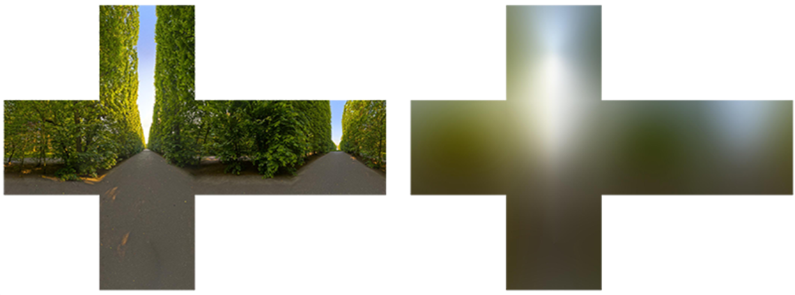
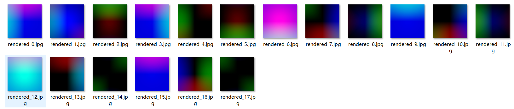
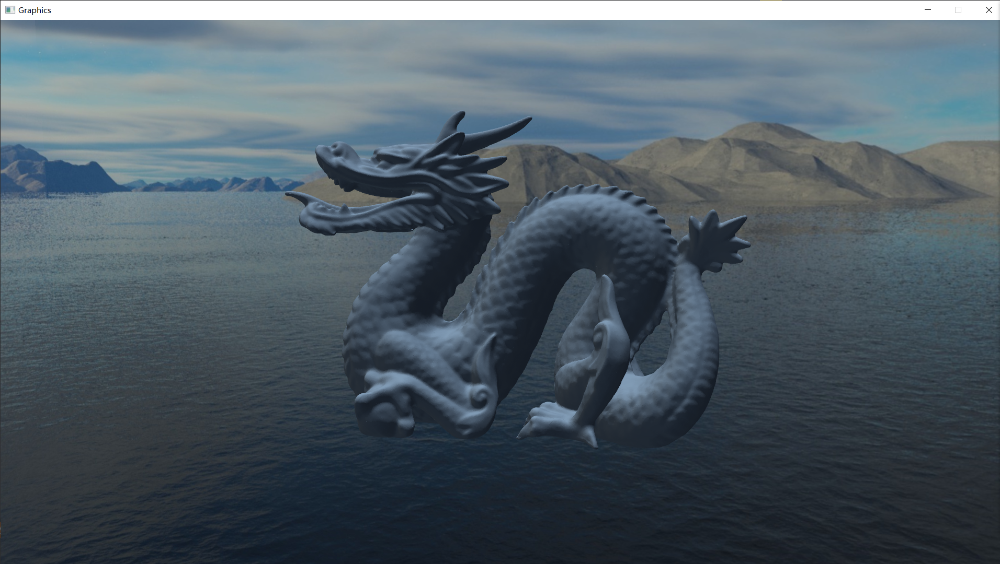

[toc]


发布于: 
创建时间: 2021-3-29 14:59:6
点赞总数: 329
评论总数: 25
收藏总数: 515
喜欢总数: 48

本专栏会不定期解析或者复现一些图形学论文：

[Monica的小甜甜：图形学论文解析与复现](https://zhuanlan.zhihu.com/p/357265599)

___

## 球谐光照

本文是03年一篇介绍球谐光照的文章，由于本文涉及到了球谐函数等数学知识，因此我在叙述的时候尽可能的从定性和定量两个角度叙述以帮助没有数学基础也能看明白！

本文包括以下五个部分

-   漫反射环境光
-   球谐函数性质
-   球谐函数
-   球谐系数
-   计算结果

## 漫反射环境光

球谐光照最主要的应用就是用于计算环境光，这里的环境光只天空盒/天空球所发出的光，通常计算环境光的手段有[IBL](https://learnopengl-cn.github.io/07%20PBR/03%20IBL/01%20Diffuse%20irradiance/)，不过IBL有些缺点，这个我们等会说。天空盒/天空球发出的环境光有什么特点？ **其中最重要的特点天空球无限大，如此一来我们可以忽略掉位置信息而只考虑法线信息。也就是说，不管我们的模型多么大，我们计算模型上某一个具体点的时候我们认为该点处于天空球中心。** 这个条件是我们简化环境光计算的关键点。我们漫反射光照计算公式如下：

$$L(p,w_o) = \int_{\Omega}L(p,\omega_i) n·\omega_idw_i \tag{1}$$

$Ω$为半球空间，入射光方向$w_i$，观察方向$w_o$，着色点$p$，$n$为着色点$p$的法线。这个公式就描述了着色点$p$在整个球面空间中收到的光照总和，由于上述环境光的特点，那么$p$就位于天空球中心点。那么光照方程就变成了：

$$L(p,w_o) =L(n)= \int_{\Omega}L(\omega_i) n·\omega_idw_i \tag{2}$$

我们发现整个光照方程就与着色点$p$的法线$n$有关了。于是 **IBL的思路就是提前计算每一个**   **法线**$n$**所对应的**$L(n)$**，将结果保存在一张立方体贴图中，然后每次计算的时候只需要用具体的法线去寻找对应的**$L(n)$**即可。** 具体方法可以参考[IBL](https://learnopengl-cn.github.io/07%20PBR/03%20IBL/01%20Diffuse%20irradiance/)



## 球谐函数性质

上面IBL的方法非常好，我们本来需要对整个球面空间进行积分就变成了一次纹理采样即可。不过这个方法 **最大的问题也就是纹理采样** ，采用IBL的方法，我们需要存储一张立方体贴图，纹理采样的带宽对于电脑来说可能不算什么，不过对于手机而言就实在是有点奢侈了，因此我们还需要继续改进。

因此我们就需要借助球谐函数的性质加以改进， **大家不要被球谐函数吓到了，不要管网上公式有多么复杂，那都是虚的，大家就想象成一个三角函数即可。** 也不建议一来就直接从第一个公式开始推。这里不加证明的给出球谐函数Y的两个重要性质：

-    **正交完备性：** 正交完备性如下，不用管具体Y是什么以及怎么算，只需要知道必须两个球谐函数一模一样才为1否则就为0即可。 **这个性质是球谐函数用来简化计算的核心。** 

$$\int_{\Omega}Y^m_l(w) Y^n_k(w)dw =\begin{cases} 1,& m==n \land l == k\\  0,& m!=n \lor l  != k\end{cases} \tag{3}$$ 

-    **旋转不变性：** 这里的旋转不变目的就是环境光照变化之后我们只需要 **简单的计算** （下篇论文详细推导）就可以得到光源旋转之后的结果。 **这个性质使得球谐函数适用性更加的强。** 

## 球谐函数

球谐函数的性质交代完了我们接下来继续优化光照公式，对于复杂的函数，我们可以通过各种方法比如泰勒展开，广义傅里叶展开。把一个复杂的函数展开成简单的函数如：

$$f(x) = \sum_{i  = 1}^{N}f_iP(x)\tag{4}$$

$f_i$为常数，$P_i(x)$为其他的函数，大家不用管$P$函数指什么，通过上面的式子可以看出来如果我们采用将函数展开的方式如果展开次数越多也就是$N$越大那么对$f(x)$的还原就越好。

展开的方式多种多样，本文介绍的就是采用球谐函数展开：

$$f(x) = \sum_{l = 0}^{\infty}\sum_{m  = -l}^{l}c^m_lY^m_l(x)=\sum_{i  = 0}^{N}c_iY_i(x) \tag{5}$$

其中$i=l*(l + 1) + m,N=l^2, c_{l}^{m}$为常数也叫做 **_球谐系数_** ，生成球谐系数的过程，也称为 **投影，** 其计算方法如下：

$$c^m_l=\int_{\Omega}f(w) Y^m_l(w)dw\tag{6}$$ 

这个式子看起来很恐怖，其实就是一个用原函数f(x)乘以对应项的球谐函数$Y_{l}^{m}$在整个球面空间积分即可，当然这个是提前预计算好的。

现在我们有了球谐函数（虽然到现在都不知道$Y_{l}^{m}$内部长什么样），也知道了球谐函数的两条性质，接下来就开始简化光照方程。对于光照方程(式1),我们把积分里面的函数分成两部分即：

$$\begin{cases} light(w) = L(p,w)\\ t(w) = n·w \end{cases} \tag{7}$$

这里为了表述方便把$w_i$写作$w$。然后我们分别对着两个函数进行球谐函数展开即：

$$\begin{cases} light(w) = \sum_{i  = 0}L_iY_i(w)\\ t(w) = \sum_{i  = 0}t_iY_i(w) \end{cases} \tag{8}$$

其中的$L_i,t_i$都是可以通过式6计算的球谐系数（后面会进行分析），这里没有写求和上限是可以用户指定，一般来说我们求漫反射环境光只需要L=3即可，也就是N=9。接下来我们代回光照积分公式1即：

$$L(p,w_o) = \int_{\Omega} light(w)·t(w)dw = \int_{\Omega} (\sum_{j=0}\sum_{i=0}(L_iY_i(w))·(t_jY_j(w)))dw$$

$$= \int_{\Omega} (\sum_{i=0}L_iY_i(w))·(\sum_{j=0}t_jY_j(w))dw$$

由于$L_i,t_i$都是常数再化简为：

$$= \sum_{j=0}\sum_{i=0}L_it_j\int_{\Omega} Y_i(w)Y_j(w)dw \tag{9}$$

这个时候只看积分里面就用得上我们的 **性质一：_正交完备性。_** 有且仅有i == j的时候$\int_{\Omega} Y_i(w)Y_j(w)dw$才为1，其余都为0。这个时候再已化解奇迹就发生了：

$$L(p,w_o) = \sum_{i=0}L_it_i\tag{10}$$ 

此时整个光照公式就化简为常数乘积之和。这就大功告成了吗？我们接着分析球谐系数$L_i,t_i$

## 球谐系数

-   分析$L_i$：

$$L_i=\int_{\Omega}L(p,w) Y_i(w)dw\tag{11}$$

原函数为$L(p,w)$，我们在公式2已经分析了， **这里函数里面虽然有着色点p，但是实际与具体着色点无关** 。因此$L_i$这一项我们可以直接对整个天空盒进行积分即可，伪代码如下

```cpp
for(pixel &p : Cubemap)
    Li += p.color * Yi(normalise(p.position)) * dw;
```

这里注意，我们直接将天空盒的位置信息进行归一化后就作为自变量。 **因为我们这个积分是球面积分，需要球面上的点，天空盒的位置进行归一化就投影到球面上去了（就好像在球面上去点一样）** 。代码链接：

[SH\_Sampler](https://github.com/AngelMonica126/GraphicAlgorithm/tree/master/SH_Sampler)

-   分析$t_i$：

$$t_i=\int_{\Omega}n·w Y_i(w)dw\tag{12}$$

大家是不是以为到这里就完了， **可惜求$t_i$是与具体着色点有关（需要知道法线信息n）。** 这也就意味着，我们如果需要预计算$t_i$，也就需要对每一个方向的法线n 都要算一组$t_i$。按照我们i=9计算，也就是我们和IBL方法相比，需要3张（每一张存3个系数）一样大小的纹理才可以！伪代码如下：

```cpp
for(normal &n: sphere)
{
    for(pixel &p : Cubemap)
        Li[n] += dot(n,normalise(p.position)) * Yi(normalise(p.position)) * dw;
}
```

预计算结果



## 计算结果



本文代码链接：[Spherical Harmonic Lighting: The Gritty Details](https://github.com/AngelMonica126/GraphicAlgorithm/tree/master/009_Spherical%20Harmonic%20Lighting%20The%20Gritty%20Details)

苍天呀！！！真的太可惜了，走到最后一步了，结果发现是多此一举。不过球谐函数如此好用的方法，科学家们怎么会放过了，嘿嘿！

 **不用着急，我们目前才用了球谐函数的第一个性质，球谐函数还是可以旋转的哦！大家想想我们可不可以把$t_i$进行旋转呢？？？！** 

 **结论肯定是可以的！** 

 **我们将在下一篇论文中详细推导不需要预计算$t_i$的方式，同时还要推导加上BRDF的公式！！！** 

 **下一篇文章：** 

[Monica的小甜甜：【论文复现】An Efficient Representation for Irradiance Environment Maps](https://zhuanlan.zhihu.com/p/363600898)

  

原文地址：[【论文复现】Spherical Harmonic Lighting:The Gritty Detai...](https://zhuanlan.zhihu.com/p/359856625) 


