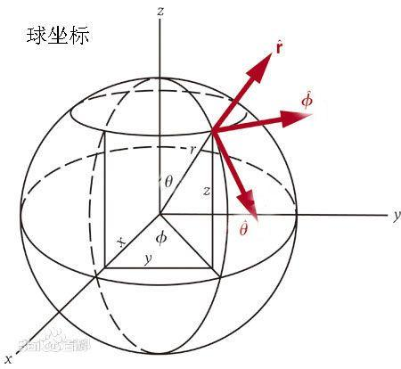

[toc]

发布于: 
创建时间: 2021-4-11 16:50:43
点赞总数: 142
评论总数: 25
收藏总数: 150
喜欢总数: 12

本专栏会不定期解析或者复现一些图形学论文：

[Monica的小甜甜：图形学论文解析与复现](https://zhuanlan.zhihu.com/p/357265599)

___

## 球谐光照 （Zonal Harmonics）

本文是紧接着[【论文复现】Spherical Harmonic Lighting:The Gritty Details](https://zhuanlan.zhihu.com/p/359856625) 的一篇文章。在上一篇文章中介绍了球谐函数以及球谐函数的性质，进而对漫反射环境光的光照公式进行化简，拆解，最终转化到采用球谐系数的乘积替代原有的光照公式，如果有遗忘大家可以回顾一下上面的文章。上一篇文章还分析了直接采用球谐系数替代原有光照的问题，即： **针对每一个方向的法线都需要预计算出一组球谐系数。** 而本文采用球谐函数旋转的特性来解决这个问题。

本文仍然在叙述的时候尽可能的从定性和定量两个角度叙述以帮助没有数学基础也能看明白！

本文一共包括以下几个部分

-   球面坐标系
-   球谐函数旋转
-   漫反射环境光
-   光泽反射环境光
-   结果

## 球面坐标系

先简单的介绍一下球面坐标系，所谓球面坐标系其实就是由方位角、仰角和距离构成的坐标系（就是把原来的三维空间中的点通过替换成与z轴的夹角$\theta$和与x轴的夹角$\phi$以及与坐标原点的距离$r$构成）如下：

只需要通过几何变换就可以从直角坐标系与球面坐标系的转化：

$$x=r\sin{\theta}\cos\phi\\ y=r\sin{\theta}\sin\phi\\ z=r\cos\theta$$

而本文讨论的都是位于单位圆上（半径$r$=1）的坐标，因此后面的讨论中都不考虑$r$.

## 球谐函数旋转

首先需要说明的是， **所谓旋转不是说直接去改变原函数，而是传入的自变量在三维空间中被旋转之后传入原函数。因此我们的目的是观察传入这个旋转之后的自变量，通过一系列化简之后原函数会怎么变成什么样。** 

$$Y^m_l(\textbf{u})\tag{1}$$

对于球谐函数如式1所示（$\textbf{u}$为三维空间的点），仍然不用关心其中每一项是什么意思。现在大家需要思考一个问题，如果将$\textbf{u}$进行旋转，这个球谐函数会如何变化呢？假设对点$\textbf{u}$进行$\alpha,\beta,\gamma$三个方向的旋转如下所示：

假设进行上述旋转操作为$R^{\alpha,\beta,\gamma}$，则球谐函数经过化简之后为：

$$Y^m_l(R^{\alpha,\beta,\gamma}(\textbf{u}))=\sum_{m'=-l}^{l}{D^l_{m',m}(R^{\alpha,\beta,\gamma})Y^{m'}_l(\textbf{u})}\tag{2}$$

$$D^l_{m',m}(R^{\alpha,\beta,\gamma})=e^{-im'\alpha}d^l_{m',m}(\beta)e^{-im\gamma}$$ 

其中$d^l_{m',m}$为维格纳D矩阵，具体表达式很复杂可以参考［1］，球谐函数的具体化简过程大家可以参考［1］［2］，这里就不复制粘贴了（逃~）。有人可能会问式2有什么意义呢，还是很复杂呀？举个例子如果$Y^{m}_l(\textbf{u})$计算需要一年，那如果想得到$\textbf{u}$旋转之后的值，就需要重新计算$Y^m_l(R^{\alpha,\beta,\gamma}(\textbf{u}))$。而式2就告诉我们，不用重新计算了，只需要把已经计算好的值再乘以一个矩阵就好了，这一下就大大简化了计算。接下来将式2代入到普通函数中试试看。

对于函数$f(\textbf{u})$,将其采用球谐函数展开如下：

$$f(\textbf{u})=\sum_{l}^{\infty}\sum_{m=-l}^{l}{c^m_lY^m_l(\textbf{u})}\tag{3}$$

同样，也将$\textbf{u}$进行旋转，代入式2得：

$$f(R^{\alpha,\beta,\gamma}(\textbf{u}))=\sum_{l}^{\infty}\sum_{m=-l}^{l}{c^m_lY^m_l(R^{\alpha,\beta,\gamma}(\textbf{u}))}$$

$$=\sum_{l}^{\infty}\sum_{m'=-l}^{l}{g^{m'}_lY^{m'}_l(\textbf{u})}$$

$$g^{m'}_l=\sum_{m=-l}^{l}c^m_lD^l_{m',m}(R^{\alpha,\beta,\gamma}) \tag{4}$$ 

经过层层变换，最终得到了式4， **这就是球谐函数的_旋转不变性_，我觉得旋转不变性描述的不够形象生动，应该叫做旋转可分离性。因为代入旋转后的点并不是最终的函数值不改变，而是我们可以通过层层化简最终将旋转操作拆分为一个函数，从而通过两个函数的乘积就得到了旋转之后的函数值。** 而根据乘法结合律，本来是应该先计算$D^l_{m',m}(R^{\alpha,\beta,\gamma})Y^{m'}_l(\textbf{u})$，我们转化为先计算$c^m_lD^l_{m',m}(R^{\alpha,\beta,\gamma})$， **如此一来就可以不用重新计算球谐系数，而是对原来的球谐系数进行处理就得到旋转之后的球谐系数。** 

## 漫反射环境光

再来看一下我们上一篇文章化简过的漫反射环境光公式：

$$L(n)= \int_{\Omega}L(\omega_i) n·\omega_idw_i \tag{5}$$

$\Omega$为半球空间，入射光方向$w_i$，$n$为着色点$p$的法线。这个公式就描述了着色点$p$在整个球面空间中收到的光照总和。

用局部坐标系重新描述漫反射环境光公式（对于不同的坐标系需要明确一点，只是参考系变了。），如下所示：

$$L(n)= \int_{\Omega}L(\omega'_i) t(\theta')dw'_i \tag{6}$$

其中$t(\theta')=n·\omega'_i=\cos\theta'$,而局部坐标系是以法线$n$为z轴的坐标系（局部坐标系下的变量都带有$'$）， **此时需要注意的入射光方向$w_i$是世界坐标系的，将其转换到以法线$n$为z轴的局部坐标系（这里只有旋转没有平移操作）** ：

$$(w_i) = R^{\alpha,\beta,\gamma}(w'_i)$$

其中$R^{\alpha,\beta,\gamma}$为将局部坐标系中的$w'_i$旋转到世界坐标系$w_i$所需要旋转的角度， **也就是法线$n$在世界坐标系的角度** （这一点后面会用到，一定要注意角度是怎么来的）。然后分别对着两个函数进行球谐函数展开。

 **展开** $L(\omega'_i)$

$$L(\omega_i)=L(R^{\alpha,\beta,\gamma}(w'_i))=\sum_{l=0}^{\infty}\sum_{m=-l}^{l}{L^m_lY^m_l(R^{\alpha,\beta,\gamma}(w'_i))}\tag{7}$$

根据上面式2所分析的，旋转$w'_i$之后得到：

$$Y^m_l(R^{\alpha,\beta,\gamma}(w'_i))=\sum_{m'=-l}^{l}{D^l_{m',m}(R^{\alpha,\beta,\gamma})Y^{m'}_l(w'_i)}\tag{8}$$ 

不过还是不能直接用式8，根据上面的图再仔细分析旋转的角度$\alpha,\beta,\gamma$， **对于光照计算公式而言我们只关心光线与法线的夹角也就是$\alpha$，那么对于其他两个角度完全可以不用旋转。** 接着继续化简式8，根据作者与Jackson［3］化简得出结论（ **注意，这里的推导不是无偏的，所以最后的结果也不是无偏的！** ）：

-   $m' !=0$的项都等于0，也就是说只用考虑$m'=0$的情况即可。
-   当$m'=0$时，在只旋转$\alpha$角的情况下，得到式9如下：

$$D^l_{m',m}(R^{\alpha,\beta,\gamma})=D^l_{0,m}(\alpha)=\sqrt{\frac{4\pi}{2l+1}}Y^{m}_l(n)\tag{9}$$

带回到式8得到

$$Y^m_l(R^{\alpha,\beta,\gamma}(w'_i))=\sqrt{\frac{4\pi}{2l+1}}Y^{m}_l(n)Y^{0}_l(w'_i)\tag{10}$$ 

最终结合式7就得到旋转$\alpha$之后的$L(\omega_i)$：

$$L(\omega_i)=L(R^{\alpha,\beta,\gamma}(w'_i))=\sum_{l=0}^{\infty}\sum_{m=-l}^{l}{L^m_l\sqrt{\frac{4\pi}{2l+1}}Y^{m}_l(n)Y^{0}_l(w'_i)}\tag{11}$$

$$L^m_l=\int_{\Omega}L(w) Y^m_l(w)dw$$

 **展开** $t(\theta')$

对于$t(\theta')$与上面$L(\omega'_i)$不同的是，这里不去求世界坐标系下的$t(\theta)$是多少而只关心在局部坐标系下的$t(\theta')$（这里与上面的区别最后讲）：

$$t(\theta')=\cos\theta'=\sum_{l=0}^{\infty}\sum_{m=-l}^{l}{t^m_lY^m_l(w'_i)}\tag{12}$$ 

同时，任然只关心与法线的夹角$\theta'$，其余角度不影响最终结果，那么将其设置为0，如此一来得到$m' !=0$的项都等于0，从而得到展开的公式为：

$$t(\theta')=\sum_{l=0}^{\infty}{t_lY^0_l(w'_i)}\tag{13}$$

$$t_l=\int_{\Omega}\cos\theta' Y^0_l(w'_i)dw'_i$$

这样有什么好处呢？，好处就在于求$t(\theta')$的球谐系数$t_l$可以求出具体的值（有人可能会问，为什么求$L(\omega'_i)$不这样做呢， **因为旋转的角度是具体的法线与坐标轴的夹角** ，对于$L(\omega_i)$而言是无法提前知道法线究竟是多少的，虽然推导出式11中包含法线的夹角，那只是为了后面进一步化简而提前做的准备）。 **注意**$t$**的下标是**$l$**的索引，对于相同的**$l$**不管**$m$**如何变都相等。** 

$$\sqrt{\frac{4\pi}{2*0+1}}t_0=\pi$$

$$\sqrt{\frac{4\pi}{2*1+1}}t_1=\frac{2}{3}\pi$$

$$\sqrt{\frac{4\pi}{2*2+1}}t_2=\frac{1}{4}\pi \tag{14}$$ 

 **求漫反射环境光** $L(n)$

最后将式14，式13，式11，代入到漫反射环境光式5中得到：

$$L(n)= \int_{\Omega}L(\omega_i) n·\omega_idw_i$$

$$=\int_{\Omega}\sum_{l=0}^{\infty}\sum_{m=-l}^{l}{L^m_l\sqrt{\frac{4\pi}{2l+1}}Y^{m}_l(n)Y^{0}_l(w'_i)}\sum_{k=0}^{\infty}{t_kY^0_k(w'_i)}dw'_i \tag{15}$$

然后再把与积分项$w'_i$无关项提出积分中：

$$L(n)=\sum_{l=0}^{\infty}\sum_{k=0}^{\infty}\sum_{m=-l}^{l}\sqrt{\frac{4\pi}{2l+1}}L^m_lt_lY^{m}_l(n)\int_{\Omega} Y^{0}_l(w'_i)Y^0_k(w'_i)dw'_i\tag{16}$$ 

再根据[上一篇文章](https://zhuanlan.zhihu.com/p/359856625)推导的 **正交完备性** 化简得到只有当$l=k$时积分里面的项才不为0反之为1，如此一来进一步化简得到：

$$L(n)=\sum_{l=0}^{\infty}\sum_{m=-l}^{l}\sqrt{\frac{4\pi}{2l+1}}L^m_lt_lY^{m}_l(n)\tag{17}$$

 **历经千辛万苦，终于得到了本文的漫反射环境光的光照公式！！！！！** 

再仔细看看这个公式巧妙在什么地方：

-   首先对于$L^m_l$而言，仍然需要预计算出来，[上一篇文章](https://zhuanlan.zhihu.com/p/359856625)有分析。
-   对于$t_l$，与上一篇文章不同，上一篇文章中需要针对每一个法线方向预计算出一组$t_l$,而本文$t_l$已经变成了如式14所求出的几个常数与$Y^{m}_l(n)$的乘积。
-   这个公式妙就妙在$Y^{m}_l(n)$，注意他的参数是具体着色点的法线$n$。那也就是说完全可以在着色器中根据顶点着色点传过来的法线$n$计算$Y^{m}_l(n)$,然后再与外部提前预计算好的$L^m_l$和$t_l$进行简单乘积就得到最终的漫反射环境光！！！！！！！

## 光泽反射环境光

接着继续推导镜面反射环境光，在解决了漫反射环境光之后，镜面反射的推导就非常简单了。对于在天空盒影响下的光泽反射环境光的光照公式如下：

$$L(p,w_o) = \int_{\Omega}L(p,\omega_i) f(p,w_i,w_o)n·\omega_idw_i \tag{18}$$

$$f(p,w_i,w_o)=\frac{DGF}{4(w_o·n)(w_i·n)}$$

$$F=F_0+(1-F_0)(1-(v·h))^5$$

像[IBL](https://zhuanlan.zhihu.com/p/360944842)中化简方式一样，我们将式18分解成两个部分（这里误差巨大，不过对于环境光而言没关系）：

$$L(p,w_o) = \int_{\Omega}L(p,\omega_i) n·\omega_idw_i*\int_{\Omega}f(p,w_i,w_o)dw_i \tag{19}$$

 **注意这里与[IBL](https://zhuanlan.zhihu.com/p/360944842) 文章中的分解方式不一样** ，$n·\omega_i$被分到前面一部分了（IBL是分到后面一部分的），而前面一部分就是式17。

对于另一部分$\int_{\Omega}f(p,w_i,w_o)dw_i$，已经在这一篇文章中[《【知识补充】基于图像的光照 IBL》](https://zhuanlan.zhihu.com/p/360944842)讨论了如何化简。这里唯一区别就是没有$n·\omega_i$，导致预计算出来的BRDF LUT有些许不同，如下：

但是球谐函数处理低频信息更好（意思是更适合处理漫反射或者是粗糙度比较大的光泽反射），因为对于纯镜面反射而言，我们需要非常高阶的球谐函数才能进行逼近，那计算量实在是太大了。

  

## 结果

终于我们通过两篇文章解决了采用球谐函数来计算环境光！！！效果与IBL相比在着色点粗糙度比较低的情况下比不上但对于其他的情况是比较好的。

 **有个很神奇的点是两篇文章我都没有介绍球谐函数究竟长什么样** 。 **其实在学习过程中要明确我们的目标是什么** ，对于这两篇文章而言都是用球谐函数来解决环境光问题，那么球谐函数只是一个工具，如果把时间都花在研究工具上那不就是本末倒置了吗？

 **球谐函数也不是仅仅只能用于求环境光，这种将函数展开的思想还普遍用于解决顺序无关的透明度等问题。** 

代码链接：[An Efficient Representation for Irradiance Environment Maps](https://github.com/AngelMonica126/GraphicAlgorithm/tree/master/011_An%20Efficient%20Representation%20for%20Irradiance%20Environment%20Maps)

  

## References

［1］ [https://en.wikipedia.org/wiki/Spherical\_harmonics](https://en.wikipedia.org/wiki/Spherical_harmonics)

［2］ [https://en.wikipedia.org/wiki/Wigner\_D-matrix](https://en.wikipedia.org/wiki/Wigner_D-matrix)

［3］ Jackson J D. Classical electrodynamics［J］. 1999.

  

原文地址：[【论文复现】An Efficient Representation for Irradiance E...](https://zhuanlan.zhihu.com/p/363600898) 

